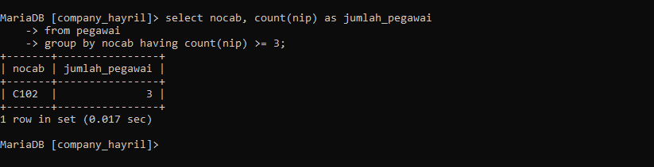

| NO  | NAMA            | KEAKTIFAN | PERAN                                 |
| :-: | :-------------- | --------- | ------------------------------------- |
|  1  | CHAIRIL ABIZALI | 3         | Membuat PPT dan Mencari Jawaban       |
|  2  | HANSAR          | 3         | Mencari soal dan sebagai logistik     |
|  3  | JORDAN          | 3         | Mencari Tema ppt dan sebagai logistik |
|  4  | MUH.TAUFIK      | 3         | Membantu mencari soal                 |
|  5  | ABD RAHMAN      | 3         | Mencari jawaban dan Membeli gorengan  |

# Tabel Pegawai


## Struktur Tabel


---

# Nomor 1
## Program
```MYSQL
select count(NIP) as jumlahpegawai,count(jabatan) as jumlahjabatan from pegawai;
```

## Hasil


## Analisis
 - `SELECT` : menentukan kolom yang ingin Anda ambil dari tabel.
 - `COUNT(NIP)` : menghitung berapa banyak baris yang memiliki nilai di kolom `NIP`.
 - `AS jumlahpegawai` : memberi nama hasil hitungan ini sebagai `jumlahpegawai`.
 - `COUNT(jabatan)` :menghitung berapa banyak baris yang memiliki nilai di kolom `jabatan`.
 - `AS jumlahjabatan` : memberi nama hasil hitungan ini sebagai `jumlahjabatan`.
 - `From PEGAWAI` : mengambil data dari tabel `pegawai`.

## Kesimpulan

Query di atas adalah dari program SQL untuk menghitung jumlah pegawai dan jumlah jabatan yang ada dalam tabel pegawai.

# Nomor 2 

## Program
```mysql
select count(nip) as jumlahpegawai
    -> from pegawai
    -> where nocab='c102';
```

## Hasil 


## Analisis 

 - `SELECT` : menentukan kolom yang ingin Anda ambil dari tabel.
 - `COUNT(NIP)` : menghitung berapa banyak baris yang memiliki nilai di kolom `NIP`.
 - `AS jumlahpegawai` : memberi nama hasil hitungan ini sebagai `jumlahpegawai`.
 - `From PEGAWAI` : mengambil data dari tabel `pegawai`.
 - `WHERE` : digunakan untuk mencari letak data yang akan di tampilkan.
 - `nocab='C102'` : kondisi data yang hanya akan di tampilkan.

## Kesimpulan

Query di atas adalah perintah untuk mengetahui berapa banyak pegawai yang terdaftar dalam kategori atau cabang tertentu, yaitu yang memiliki `nocab` `'c102'`.

# Nomor 3

## Program
```mysql
 select nocab , count(nip) as jumlah_pegawai
 from pegawai
 group by nocab;
```


## Hasil


## Analisis 

- `SELECT` : menentukan kolom yang ingin Anda ambil dari tabel.
- `COUNT(NIP)` : menghitung berapa banyak baris yang memiliki nilai di kolom `NIP`.
- `AS jumlahpegawai` : memberi nama hasil hitungan ini sebagai `jumlahpegawai`.
- `from PEGAWAI` : mengambil data dari tabel `pegawai`.
- `GROUP BY nocab` : Mengelompokkan baris-baris dalam tabel berdasarkan nilai di kolom `nocab`.

## Kesimpulan

Query di atas adalah perintah yang digunakan untuk menghitung jumlah pegawai (berdasarkan `nip`) yang mengelompokkannya sesuai dengan noCab nya.

# Nomor 4

## Program 
```MYSql
 select nocab, count(nip) as jumlah_pegawai
 from pegawai
 group by nocab having count(nip) >= 3;
```

## Hasil 



## Analisis

- `SELECT` : menentukan kolom yang ingin Anda ambil dari tabel.
- `nocab`: Kolom ini akan ditampilkan dalam hasil query.
- `COUNT(NIP)` : menghitung berapa banyak baris yang memiliki nilai di kolom `NIP`.
- `AS jumlahpegawai` : memberi nama hasil hitungan ini sebagai `jumlahpegawai`.
- `from PEGAWAI` : mengambil data dari tabel `pegawai`.
- `GROUP BY nocab` : Mengelompokkan baris-baris dalam tabel berdasarkan nilai di kolom `nocab`.
- `HAVING` : digunakan untuk memfilter grup yang dihasilkan oleh klausa `GROUP BY`.
- `COUNT(nip) >= 3` : memilih jumlah pegawai (`COUNT(nip)`) dan menampilkan nocab yang memiliki  3 data pegawai yang sama. 

## Kesimpulan

Query di atas adalah perintah untuk membantu mengetahui berapa banyak pegawai yang ada dalam setiap kelompok `nocab`, tetapi hanya menampilkan kelompok `nocab` yang memiliki 3 atau lebih pegawai.

# Nomor 5

## Program 

```mysql
select sum(gaji) as total_gaji
from pegawai;
```

## Hasil 


## Analisis

- `SELECT` : menentukan kolom yang ingin Anda ambil dari tabel.
- `SUM(gaji)`: Fungsi agregat ini menghitung total atau jumlah seluruh nilai dalam kolom `gaji`.
- `AS total_gaji`: ini memberikan nama agar lebih mudah dipahami hasil dari perintah `SUM(gaji)` sebagai `total_gaji`. Alias digunakan untuk membuat nama kolom hasil lebih mudah dipahami.
- `from PEGAWAI` : mengambil data dari tabel `pegawai`.

## Kesimpulan

Query di atas adalah perintah untuk   mengetahui total jumlah gaji keseluruhan dari nilai gaji yang ada di tabel tersebut.

# Nomor 6

## Program

```mysql
 select sum(gaji) as total_gaji
 from pegawai
 where jabatan = 'manajer';
```

## Hasil 


## Analisis

- `SELECT` : menentukan kolom yang ingin Anda ambil dari tabel.
- `SUM(gaji)`: Fungsi agregat ini menghitung total atau jumlah seluruh nilai dalam kolom `gaji`.
- `AS total_gaji`: ini memberikan nama agar lebih mudah dipahami hasil dari perintah `SUM(gaji)` sebagai `total_gaji`. Alias digunakan untuk membuat nama kolom hasil lebih mudah dipahami.
 - `from PEGAWAI` : mengambil data dari tabel `pegawai`.
 - `WHERE` : digunakan untuk mencari letak data yang akan di tampilkan.
 - `jabatan='manajer'` :kondisi data yang ingin dijumlahkan.

## Kesimpulan

Query di atas adalah perintah yang digunakan untuk menghitung total gaji semua pegawai yang memiliki jabatan 'manajer' dalam tabel `pegawai`.

# Nomor 7 

## Program

```mysql
 select nocab,sum(gaji) as totalgaji
 from pegawai
 group by nocab;
```

## Hasil


## Analisis

- `SELECT` : menentukan kolom yang ingin Anda ambil dari tabel.
- `SUM(gaji)`: Fungsi agregat ini menghitung total atau jumlah seluruh nilai dalam kolom `gaji`.
- `AS total_gaji`: ini memberikan nama agar lebih mudah dipahami hasil dari perintah `SUM(gaji)` sebagai `total_gaji`. Alias digunakan untuk membuat nama kolom hasil lebih mudah dipahami.
 - `from PEGAWAI` : mengambil data dari tabel `pegawai`.
 - `group by noCab` : Mengelompokkan baris-baris dalam tabel berdasarkan nilai di kolom `nocab`.

## Kesimpulan

Query di atas adalah perinatah yang digunakan untuk menghitung total gaji pegawai untuk setiap kelompok `nocab` dalam tabel `pegawai`.

# Nomor 8

## Program

```mysql
 select nocab,sum(gaji) as total_gaji
 from pegawai
 group by nocab having sum(gaji) >=8000000;
```

## Hasil 


## Analisis

- `SELECT` : menentukan kolom yang ingin Anda ambil dari tabel.
- `SUM(gaji)`: Fungsi agregat ini menghitung total atau jumlah seluruh nilai dalam kolom `gaji`.
- `AS total_gaji`: ini memberikan nama agar lebih mudah dipahami hasil dari perintah `SUM(gaji)` sebagai `total_gaji`. Alias digunakan untuk membuat nama kolom hasil lebih mudah dipahami.
 - `from PEGAWAI` : mengambil data dari tabel `pegawai`.
 - `HAVING SUM(gaji) >= 8000000:` : digunakan untuk memfilter grup yang dihasilkan oleh klausa `GROUP BY` dan menampilan hanya hasil penjumlahan gaji yang lebih dari 8.000.000 akan di tampilkan.

## Kesimpulan

Query di atas adalah perintah yang digunakan untuk menghitung total gaji pegawai untuk setiap kelompok `nocab`, dan hanya menampilkan kelompok `nocab` yang memiliki total gaji 8.000.000 atau lebih.

# Nomor 9

## Program 
```mysql
select avg(gaji) as rata_rata
from pegawai;
```

## Hasil 


## Analisis

- `SELECT` : menentukan kolom yang ingin Anda ambil dari tabel.
- `AVG(gaji)`: Fungsi agregat ini menghitung nilai rata rata dalam kolom `gaji`.
- `AS rata_rata`: ini memberikan nama agar lebih mudah dipahami hasil dari perintah `AVG(gaji)` sebagai `rata_rata`. Alias digunakan untuk membuat nama kolom hasil lebih mudah dipahami.
- `from PEGAWAI` : mengambil data dari tabel `pegawai`.

## Kesimpulan 

Query di atas adalah perintah untuk   mengetahui nilai rata rata keseluruhan dari nilai gaji yang ada di tabel tersebut.

## Nomor 10 

## Program 
```mysql
SELECT avg(gaji) as gajiRataMgr
from pegawai
where jabatan = 'manajer';
```

## Hasil 


## Analisis
- `SELECT` : menentukan kolom yang ingin Anda ambil dari tabel.
- `AVg(gaji)`: Fungsi agregat ini menghitung jumlah rata rata seluruh nilai dalam kolom `gaji`.
- `AS GajiRataMgr`: ini memberikan nama agar lebih mudah dipahami hasil dari perintah `AVG(gaji)` sebagai `GajiRataMgr`. Alias digunakan untuk membuat nama kolom hasil lebih mudah dipahami.
 - `from PEGAWAI` : mengambil data dari tabel `pegawai`.
 - `WHERE` : digunakan untuk mencari letak data yang akan di tampilkan.
 - `jabatan='manajer'` :kondisi data yang ingin di cari rata-rata.

## Kesimpulan

Query di atas adalah perintah yang digunakan untuk menghitung nilai rata rata gaji semua pegawai yang memiliki jabatan 'manajer' dalam tabel `pegawai`.

# Nomor 11

## Program 

```Mysql 
select nocab,avg(gaji) as ratagaji
from pegawai
group  by nocab;
```

## Hasil 


## Analisis

- `SELECT` : menentukan kolom yang ingin Anda ambil dari tabel.
- `AVG(gaji)`: Fungsi agregat ini menghitung nilai rata rata jumlah seluruh nilai dalam kolom `gaji`.
- `AS RataGaji`: ini memberikan nama agar lebih mudah dipahami hasil dari perintah `AVG(gaji)` sebagai `RataGaji`. Alias digunakan untuk membuat nama kolom hasil lebih mudah dipahami.
 - `from PEGAWAI` : mengambil data dari tabel `pegawai`.
 - `group by noCab` : Mengelompokkan baris-baris dalam tabel berdasarkan nilai di kolom `nocab`.

## Kesimpulan

Query di atas adalah perinatah yang digunakan untuk menghitung nilai rata rata gaji pegawai untuk setiap kelompok `nocab` dalam tabel `pegawai`.

# Nomor 12

## Program 
```mysql 
SELECT nocab, AVG(gaji) AS rata_gaji
FROM pegawai
GROUP BY nocab
HAVING nocab = 'c101' OR nocab = 'c102';
```

## Hasil 


## Analisis 

- `SELECT` : menentukan kolom yang ingin Anda ambil dari tabel.
- `COUNT(NIP)` : menghitung berapa banyak baris yang memiliki nilai di kolom `NIP`.
- `AS jumlahpegawai` : memberi nama hasil hitungan ini sebagai `jumlahpegawai`.
- `from PEGAWAI` : mengambil data dari tabel `pegawai`.
- `GROUP BY nocab` : Mengelompokkan baris-baris dalam tabel berdasarkan nilai di kolom `nocab`.
- `HAVING nocab = 'c101' OR nocab = 'c102'` : Ini menyaring hasil grup yang telah dibentuk untuk hanya menyertakan grup dengan `nocab` yang bernilai 'c101' atau 'c102'. Klausa `HAVING` digunakan setelah pengelompokan (`GROUP BY`) untuk menyaring grup tersebut.

## Kesimpulan

Query di atas adalah perintah yang bertujuan untuk menampilkan rata-rata gaji dari karyawan yang diidentifikasi oleh kode cabang atau departemen (`nocab`) tertentu, yaitu 'c101' dan 'c102'.

# Nomor 13

## Program 

```mysql
select max(gaji) as gajiTerbesar , min(gaji) as gajiTerkecil
from pegawai;
```

## Hasil 


## Analisis 

- `SELECT` : menentukan kolom yang ingin Anda ambil dari tabel.
- `max(gaji) AS gajiTerbesar`: Ini menghitung nilai maksimum dari kolom `gaji` dan memberikan nama hasilnya sebagai `gajiTerbesar`.
- `min(gaji) AS gajiTerkecil`: Ini menghitung nilai minimum dari kolom `gaji` dan memberikan nama hasilnya sebagai `gajiTerkecil`.
- `from PEGAWAI` : mengambil data dari tabel `pegawai`.

## Kesimpulan 

Query di atas adalah perintah memilih dua nilai yang dihitung, yaitu nilai maksimum `gaji` (diberi nama `gajiTerbesar`) dan nilai minimum `gaji` (diberi nama `gajiTerkecil`).

# Nomor 14

## Program 
```MySQl
 select max(gaji) as gajiTerbesar , min(gaji) as gajiterkecil
 from pegawai
 where jabatan = 'manajer';
```

## Hasil 


## Analisis 

- `SELECT` : menentukan kolom yang ingin Anda ambil dari tabel.
- `max(gaji) AS gajiTerbesar`: Ini menghitung nilai maksimum dari kolom `gaji` dan memberikan nama hasilnya sebagai `gajiTerbesar`.
- `min(gaji) AS gajiTerkecil`: Ini menghitung nilai minimum dari kolom `gaji` dan memberikan nama hasilnya sebagai `gajiTerkecil`.
 - `from PEGAWAI` : mengambil data dari tabel `pegawai`.
 - `WHERE` : digunakan untuk mencari letak data yang akan di tampilkan.
 - `jabatan='manajer'` :kondisi data yang ingin di cari jumlah maksimal dan minimal nya.

## Kesimpulan
Query di atas adalah perintah yang bertujuan untuk menampilkan gaji terbesar dan gaji terkecil dari semua karyawan dengan jabatan 'manajer' yang ada di tabel pegawai.

# Nomor 15

## Program 

```mysql 
	 select nocab,max(gaji) as gajiTerbesar , min(gaji) as gajiTerkecil
	    -> from pegawai
	    -> group by nocab;
```

## Hasil


## Analisis 

- `SELECT` : menentukan kolom yang ingin Anda ambil dari tabel.
- `max(gaji) AS gajiTerbesar`: Ini menghitung nilai maksimum dari kolom `gaji` dan memberikan nama hasilnya sebagai `gajiTerbesar`.
- `min(gaji) AS gajiTerkecil`: Ini menghitung nilai minimum dari kolom `gaji` dan memberikan nama hasilnya sebagai `gajiTerkecil`.
 - `from PEGAWAI` : mengambil data dari tabel `pegawai`.
 - `group by noCab` : Mengelompokkan baris-baris dalam tabel berdasarkan nilai di kolom `nocab`.

## Kesimpulan

Query di atas adalah perintah yang bertujuan untuk menampilkan gaji terbesar dan gaji terkecil dari karyawan yang dikelompokkan berdasarkan `nocab`, sehingga Anda dapat melihat nilai tertinggi dan terendah dari gaji dalam setiap cabang atau departemen yang diidentifikasi oleh `nocab`.

# Nomor 16

## Program

```mysql 
 select nocab,max(gaji) as gajiTerbesar , min(gaji) as gajiTerkecil
 from pegawai
  group by nocab having count(nip) >= 3;
```

## Hasil 


## Analisis 

- `SELECT` : menentukan kolom yang ingin Anda ambil dari tabel.
- `nocab` : Kolom ini dipilih langsung dari tabel `pegawai`.
- `max(gaji) AS gajiTerbesar` : Menghitung nilai maksimum dari kolom `gaji` dalam setiap grup `nocab` dan memberikan nama hasilnya sebagai `gajiTerbesar`.
- `min(gaji) AS gajiTerkecil:` Menghitung nilai minimum dari kolom `gaji` dalam setiap grup `nocab` dan memberikan nama hasilnya sebagai `gajiTerkecil`.
 - `from PEGAWAI` : mengambil data dari tabel `pegawai`.
 - `HAVING count(nip) >= 3` :Menyaring grup yang telah dikelompokkan untuk hanya menyertakan grup dengan jumlah karyawan (dihitung dengan `count(nip)`) sebanyak 3 atau lebih.

## Kesimpulan

Query di atas adalah perintah yang bertujuan untuk menampilkan gaji terbesar dan gaji terkecil dari setiap cabang atau departemen (`nocab`) yang memiliki setidaknya 3 karyawan.

# Nomor 17

## Program 

```Mysql 
select count(nip) as jumlahPegawai , sum(gaji) as Totalgaji,
AVG(gaji) as ratagaji , max(gaji) as gajiMaks , Min(gaji) as gajiMin
from pegawai;
```

## Hasil 


## Analisis

- `SELECT` : menentukan kolom yang ingin Anda ambil dari tabel.
- `count(nip) AS jumlahPegawai`: Menghitung jumlah total baris (karyawan) berdasarkan kolom `nip` dan memberi nama hasilnya sebagai `jumlahPegawai`.
- `sum(gaji) AS Totalgaji`: Menghitung jumlah total dari kolom `gaji` dan memberi nama hasilnya sebagai `Totalgaji`.
- `AVG(gaji) AS ratagaji`: Menghitung nilai rata-rata dari kolom `gaji` dan memberi nama hasilnya sebagai `ratagaji`.
- `max(gaji) AS gajiMaks`: Menghitung nilai maksimum dari kolom `gaji` dan memberi nama hasilnya sebagai `gajiMaks`.
- `min(gaji) AS gajiMin`: Menghitung nilai minimum dari kolom `gaji` dan memberi nama hasilnya sebagai `gajiMin`.
 - `from PEGAWAI` : mengambil data dari tabel `pegawai`.


## Kesimpulan 

Query di atas adalah perintah yang bertujuan untuk memberikan gambaran umum tentang data gaji di tabel `pegawai`, dengan menghitung jumlah karyawan, total gaji, rata-rata gaji, gaji maksimum, dan gaji minimum.

# Nomor 18

## Program 

```mysql 
 select count(nip) as jumlahPegawai ,Sum(gaji) as totalGaji,
 Avg(gaji) as ratagaji , Max(gaji) as gajiMaks ,Min(Gaji) as MinGaji
 from pegawai
 where jabatan = 'staf' or jabatan = 'sales'
 group by nocab having sum(gaji) <= 2600000;
```

## Hasil 


## Analisis 

- `SELECT` : menentukan kolom yang ingin Anda ambil dari tabel.
- `count(nip) AS jumlahPegawai`: Menghitung jumlah total baris (karyawan) berdasarkan kolom `nip` dan memberi nama hasilnya sebagai `jumlahPegawai`.
- `sum(gaji) AS Totalgaji`: Menghitung jumlah total dari kolom `gaji` dan memberi nama hasilnya sebagai `Totalgaji`.
- `AVG(gaji) AS ratagaji`: Menghitung nilai rata-rata dari kolom `gaji` dan memberi nama hasilnya sebagai `ratagaji`.
- `max(gaji) AS gajiMaks`: Menghitung nilai maksimum dari kolom `gaji` dan memberi nama hasilnya sebagai `gajiMaks`.
- `min(gaji) AS gajiMin`: Menghitung nilai minimum dari kolom `gaji` dan memberi nama hasilnya sebagai `gajiMin`.
 - `from PEGAWAI` : mengambil data dari tabel `pegawai`.
 - `GROUP BY nocab` : Mengelompokkan data berdasarkan kolom `nocab`. Setiap nilai unik `nocab` membentuk satu grup.
 - `HAVING Sum(gaji) <= 2600000` : Menyaring grup yang telah dikelompokkan untuk hanya menyertakan grup dengan total gaji (`Sum(gaji)`) kurang dari atau sama dengan 2.600.000.

## Kesimpulan

Query di atas adalah perintah yang bertujuan untuk memberikan informasi tentang jumlah karyawan, total gaji, rata-rata gaji, gaji maksimum, dan gaji minimum untuk setiap cabang (`nocab`) yang memiliki total gaji di bawah atau sama dengan 2.600.000, khusus untuk jabatan 'staf' atau 'sales'.
