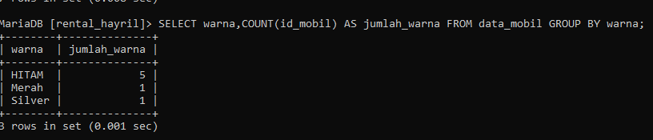
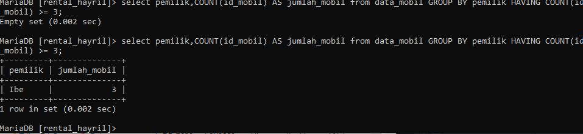
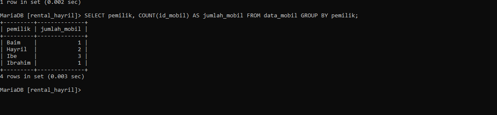
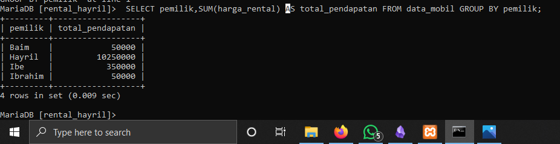
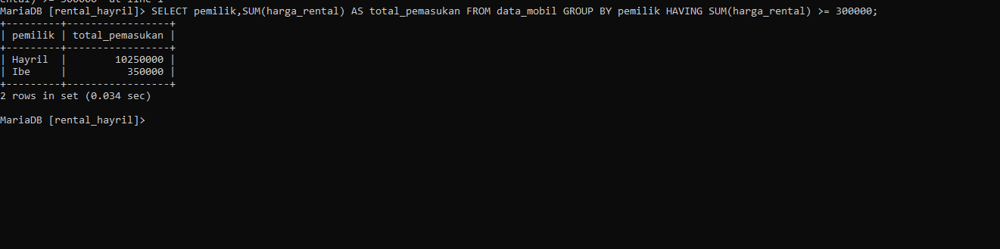
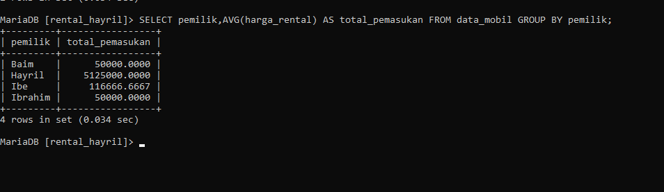
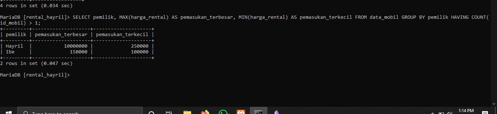

 
# Group By and Having

## 1. Tampilkan Jumlah data mobil dan kelompok berdasarkan warna nya sesuai dengan tabel mobil kalian

### Struktur
```mySQL 
select data 2,COUNT(Data 1) AS nama_sementara FROM nama_tabel GROUP BY data 2;
```

### Contoh

```mySQL
SELECT warna,
COUNT(id_mobil) AS jumlah_warna 
FROM data_mobil GROUP BY warna;
```

### Hasil 

### Analisis

- `SELECT warna, COUNT(id_mobil) AS jumlah_warna`: Memilih kolom `warna` dan menghitung jumlah baris `id_mobil` untuk setiap warna.
- `FROM mobil`: Menentukan tabel yang ingin di tampilkan, yaitu `data_mobil`.
- `GROUP BY warna`: Mengelompokkan hasil berdasarkan kolom `warna`.

### Kesimpulan 
Query di atas berfungsi untuk mengelompokkan hasil sesuai dengan jumlah mobil berdasarkan warnanya.

## 2. Berdasarkan Query in tampilkan yang lebih besar dari 3 atau sama dengan 3 pemilik mobilnya 

### Struktur

```mySQL 
select data 3,COUNT(id_mobil) AS nama_sementara from nama_tabel GROUP BY data 3 HAVING COUNT(data 1) >= 3;
```

### Contoh 

```mySQL
select pemilik,COUNT(id_mobil) AS jumlah_mobil from data_mobil GROUP BY pemilik HAVING COUNT(id_mobil) >= 3;
```

### Hasil 


### Analisis

- `SELECT`: Perintah untuk memilih kolom yang akan ditampilkan dalam hasil query.
- `pemilik`: Kolom yang menyimpan informasi tentang pemilik mobil.
- `COUNT(id_mobil) AS jumlah_mobil`: Menghitung jumlah baris dalam setiap grup yang memiliki nilai `id_mobil` dan memberikan alias `jumlah_mobil` pada hasil hitungan tersebut.
- `FROM`: Menentukan tabel sumber data yang digunakan dalam query.
- `data_mobil`: Nama tabel yang berisi data mobil termasuk informasi tentang pemilik dan id mobil.
- `GROUP BY`: Mengelompokkan hasil query berdasarkan kolom tertentu.
- `pemilik`: Kolom yang digunakan untuk mengelompokkan data.
- `HAVING`: Klausul yang digunakan untuk menyaring grup berdasarkan hasil agregat.
- `COUNT(id_mobil) >= 3`: Kondisi penyaringan yang hanya menyertakan grup di mana jumlah `id_mobil` adalah 3 atau lebih.

### Kesimpulan
Query di atas adalah perintah untuk mengelompokkan nama pemilik yang memiliki jumlah mobil lebih atau sama dengan 3.

## 3.Tampilkan semua pemilik dengan jumlah mobilnya yang memiliki atau sama dengan 3 mobil 

### Struktur

```mySQL 
SELECT nama_data,COUNT(nama_data) AS nama_sementara FROM nama_tabel GROUP BY nama_data;
```

### Contoh 

```mySQL 
SELECT pemilik, 
COUNT(id_mobil) AS jumlah_mobil 
FROM data_mobil GROUP BY pemilik;
```

### Hasil 


### Analisis
- `SELECT` : adalah perintah untuk memilih kolom yang akan ditampilkan 
- `pemilik`:adalah nama kolom yang telah dipilih
- `COUNT(id_mobil) AS jumlah_mobil`: Menghitung jumlah mobil yang dimiliki oleh setiap pemilik dan memberikan alias `jumlah_mobil` pada hasil hitungan tersebut.
- `FROM data_mobil`: adalah perintah untuk mengambil data dari tabel `data_mobil`.
- `GROUP BY pemilik`: adalah perintah untuk mengelompokkan hasil berdasarkan kolom `pemilik`.

### Kesimpulan
Query di atas adalah perintah untuk mengelompokkan data pemilik mobil dan menghitung jumlah mobil yang dimiliki setiap `pemilik`

## 4.Berdasarkan Query yang ada pada praktikum 5 bagian 7 tampilkan data pada tabel mobil dengan mengelompokkan SUM TOTAL pendapat pemilik berdasarkan harga rental

### Struktur 

```mySQL 
select data 3,SUM(data 5) AS nama_sementara from nama_tabel GROUP BY data 3;
```

### Contoh
```mySQL 
SELECT pemilik,
SUM(harga_rental) AS total_pendapatan
FROM data_mobil GROUP BY pemilik;
```

### Hasil 



### Analisis

- `SELECT` : adalah perintah untuk memilih kolom yang akan ditampilkan 
- `pemilik`:adalah nama kolom yang telah dipilih
- `SUM(harga_rental)`: Fungsi perhitungan yang menjumlahkan nilai `harga_rental` dalam setiap grup.
- `AS total_pendapatan`: adalah perintah untuk membuat kolom hasil penjumlahan, membuat hasil lebih mudah dibaca.
- `FROM data_mobil`: adalah perintah untuk mengambil data dari tabel `data_mobil`.
- `GROUP BY pemilik`: adalah perintah untuk mengelompokkan hasil berdasarkan kolom `pemilik`.

### Kesimpulan

Query di atas adalah perintah untuk menjumlahkan setiap data `harga_rental` dan mengelompokkan dalam hasil nya dalam kolom `hasil_pendapatan`.

## 5. Berdasarkan praktikum 5 query no 8 tampilkan jumlah pemasukan pemilik berdasarkan harga rental kelompokkan berdasarkan pemiliknya dan seleksi yang total pemasukannya atau harga rentalnya mencapai lebih besar atau sama dengan 300k

### Struktur
```mysql
select data_mobil,SUM(data_mobil) AS nama_sementara from nama_tabel GROUP BY data_mobil HAVING SUM(data_mobil) >= 300000;
```

### Query
```mysql
SELECT pemilik,
SUM(harga_rental) AS total_pemasukan
FROM data_mobil GROUP BY pemilik
HAVING SUM(harga_rental) >= 300000;
```

### Hasil 


### Analisis
 - `SELECT` : adalah perintah untuk memilih kolom yang akan ditampilkan 
- `pemilik`:adalah nama kolom yang telah dipilih
- `SUM(harga_rental)`: Fungsi perhitungan yang menjumlahkan nilai `harga_rental` dalam setiap grup.
- `AS total_pendapatan`: adalah perintah untuk membuat kolom hasil penjumlahan, membuat hasil lebih mudah dibaca.
- `FROM data_mobil`: adalah perintah untuk mengambil data dari tabel `data_mobil`.
- `GROUP BY pemilik`: adalah perintah untuk mengelompokkan hasil berdasarkan kolom `pemilik`.
- `HAVING SUM(harga_rental) >= 300000;`:adalah perintah untuk mengelompokkan dan menyeleksi data kolom `harga_rental` yang jumlah nya lebih atau sama dengan 300.000

### Kesimpulan

Query di atas adalah perintah untuk menghitung jumlah `harga_rental` setiap `pemilik` dan mengelompokkan dalam kolom `total_pemasukan` yang jumlahnya lebih atau sama dengan 300.000

## 6.Berdasarkan Praktikum 6 NO.12 Tampilkan Rata Rata pemasukkan pemilik mobil kelompokkan berdasarkan pemiliknya

### Struktur 

```mySQL 
select nama_data,AVG(nama_data) AS nama_sementara from nama_tabel GROUP BY nama_data;
```

### Contoh 
```mySQL
SELECT pemilik,
AVG(harga_rental) AS total_pemasukan
FROM data_mobil GROUP BY pemilik;
```

### Hasil 



### Analisis

- `SELECT` : adalah perintah untuk memilih kolom yang akan ditampilkan 
- `pemilik`:adalah nama kolom yang telah dipilih
- `AVG(harga_rental)`: Fungsi perhitungan yang menghitung nilai rata-rata `harga_rental` dalam setiap grup.
- `AS total_pemasukan`: adalah perintah untuk membuat kolom hasil penjumlahan, membuat hasil lebih mudah dibaca.
- `FROM data_mobil`: adalah perintah untuk mengambil data dari tabel `data_mobil`.
- `GROUP BY pemilik`: adalah perintah untuk mengelompokkan hasil berdasarkan kolom `pemilik`.

### Kesimpulan

Query di atas adalah perintah untuk menghitung nilai rata rata setiap data `harga_rental` dan mengelompokkan dalam hasil nya dalam kolom `hasil_pemasukan`.

## 7.Berdasarkan Praktikum 5 NO.16 tampilkan pemasukan terbesar dan pemasukan terkecil kelompokkan berdasarkan pemiliknya dan seleksi data pemilik yang tampil atau jumlah mobil lebih besar dari 1

### Struktur 
```mySQL 
select nama_data,MAX(nama_data) AS nama_sementara,MIN(nama_data) AS nama_sementara from nama_tabel GROUP BY nama_data HAVING COUNT(nama_data) >= 1;
```

### Contoh
```mySQL 
SELECT pemilik, 
MAX(harga_rental) AS pemasukan_terbesar, 
MIN(harga_rental) AS pemasukan_terkecil
FROM data_mobil GROUP BY pemilik
HAVING COUNT(id_mobil) > 1;
```

### Hasil


### Analisis

- `SELECT` : adalah perintah untuk memilih kolom yang akan ditampilkan 
- `pemilik`:adalah nama kolom yang telah dipilih
- `MAX(harga_rental)`: Fungsi perhitungan yang menghitung nilai  terbesar `harga_rental` dalam setiap grup.
- `MIN(harga_rental)`: Fungsi perhitungan yang menghitung nilai  terkecil `harga_rental` dalam setiap grup.
- `GROUP BY pemilik`: adalah perintah untuk mengelompokkan hasil berdasarkan kolom `pemilik`.
- `HAVING`: Klausul yang digunakan untuk menyaring grup berdasarkan hasil agregat.
- `COUNT(id_mobil) > 1`: Kondisi penyaringan yang hanya menyertakan grup di mana jumlah `id_mobil` adalah 1 .

### Kesimpulan

Query di atas adalah perintah untuk menghitung data terbesar dan terkecil kolom `harga_rental` dan mengelompokkan kemudian membagi menjadi 2 kolom yaitu terbesar dan terkecil nya.