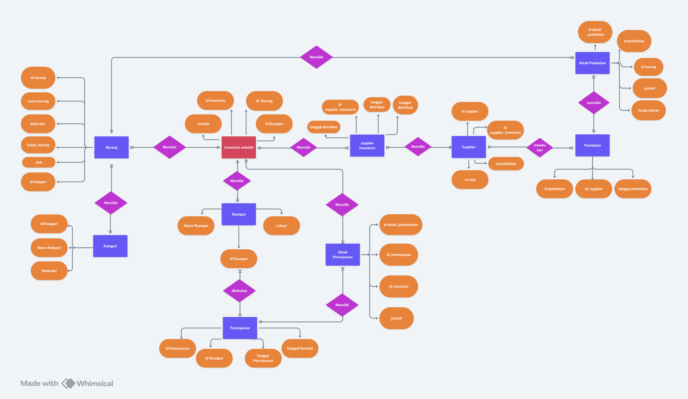
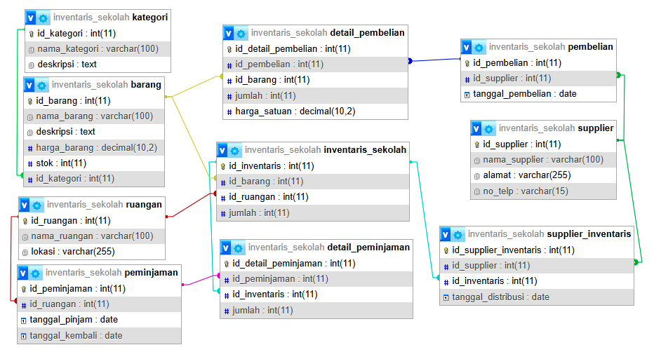
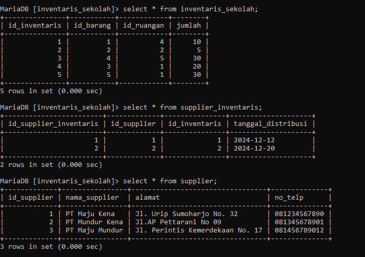
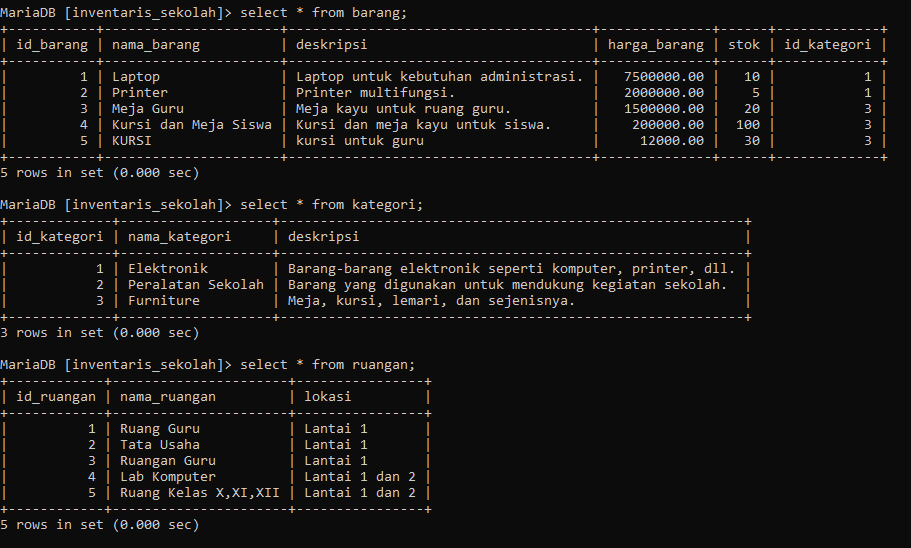
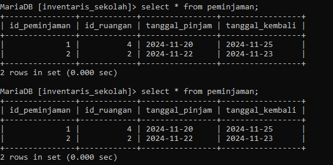
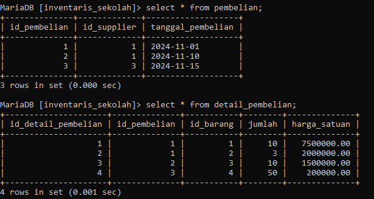
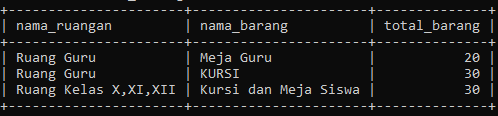
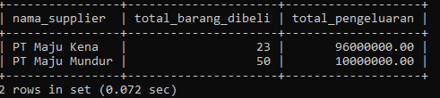

# Tabel Keaktifan
| NO  | NAMA            | KEAKTIFAN | PERAN                                |
| :-: | :-------------- | --------- | ------------------------------------ |
|  1  | ABD RAHMAN      | 3         | mencari query dan penjelasan         |
|  2  | HANSAR          | 3         | mencari penjelasan query             |
|  3  | JORDAN          | 3         | mencari analisis relasi tabel        |
|  4  | MUH.TAUFIK      | 3         | mengerjakan relasi tabel             |
|  5  | CHAIRIL ABIZALI | 3         | Mengerjakan erd dan mencari analisis |

# Soal
1. Setiap kelompok merancang database di MySQL dari hasil perencanaan ERD-nya masing-masing. Di dalam database tersebut wajib menjadikan tabel berelasi, dengan menambah foreign key.
2. Selanjutnya tampilkan datanya secara kontekstual dengan menggunakan query relasi, group by, dan having secara bersamaan dalam satu query. Buatlah minimal sebanyak 2 contoh.
3. Sertakan pula penjelasan dan analisis kalian pada soal nomor 1 dan 2.

---
## ERD

### Penjelasan ERD
Pada Tampilan ERD Kami Memiliki 10 entitas dan setiap entitas mempunyai atribut masing masing,setiap entitas saling berelasi dengan menggunakan kardinalitas. 
 **1. Relasi antara Tabel `Barang` dan Tabel `Kategori`**
- **Kardinalitas:** **1-to-n** (Satu ke banyak)
    - **Penjelasan:**
        - Setiap barang hanya dapat dimiliki oleh satu kategori (seperti peralatan komputer, furniture, dll).
        - Sebaliknya, satu kategori bisa memiliki banyak barang. Misalnya, kategori "Peralatan Kantor" bisa memiliki beberapa jenis barang seperti meja, kursi, dan lemari.
    - **Relasi:**
        - Tabel **Barang** memiliki foreign key (`id_kategori`) yang mengacu pada primary key di tabel **Kategori** (`id_kategori`).

**2. Relasi antara Tabel `Barang` dan Tabel `Detail_Pembelian`**
- **Kardinalitas:** **1-to-n** (satu ke banyak)
    - **Penjelasan:**
        - Satu barang dapat muncul dalam banyak transaksi pembelian. Sebagai contoh, barang yang sama (misalnya, komputer) bisa dibeli di berbagai kesempatan.
        - Sebaliknya, satu transaksi pembelian barang bisa mencakup banyak detail_pembelian. Misalnya, dalam satu pembelian, bisa membeli komputer, kursi, dan meja.
    - **Relasi:**
        - Relasi ini diwakili oleh tabel **Detail_Pembelian**, yang berfungsi sebagai tabel pivot antara **Barang** dan **Pembelian**.
        - Tabel **Detail_Pembelian** memiliki dua foreign key:
            - `id_barang` yang mengacu pada tabel **Barang**.
            - `id_pembelian` yang mengacu pada tabel **Pembelian**.

 **3. Relasi antara Tabel `Pembelian` dan Tabel `Supplier`**
- **Kardinalitas:** **n-to-1** (banyak ke satu)
    - **Penjelasan:**
        - banyak pembelian dapat dilakukan oleh hanya satu supplier tertentu. Jadi, banyak transaksi pembelian cuma bisa berasal dari satu supplier.
        - Sebaliknya, satu supplier dapat melakukan banyak transaksi pembelian. Sebagai contoh,satu supplier dapat menyediakan barang dalam beberapa pembelian berbeda.
    - **Relasi:**
        - Tabel **Pembelian** memiliki foreign key `id_supplier` yang mengacu pada primary key `id_supplier` di tabel **Supplier**.

 **4. Relasi antara Tabel `Inventaris Sekolah` dan Tabel `Barang`**
- **Kardinalitas:** **n-to-1** (Banyak ke satu)
    - **Penjelasan:**
        - Setiap barang dalam **Inventaris Sekolah** berhubungan dengan satu jenis barang yang tercatat di tabel **Barang**. Barang tersebut bisa berada di banyak tempat atau ruangan, tetapi tetap akan merujuk pada satu item yang sama dalam tabel **Barang**.
        - Sebaliknya, satu barang bisa ada dalam beberapa lokasi (ruangan) yang berbeda di sekolah, seperti di perpustakaan, laboratorium, atau ruang guru.
    - **Relasi:**
        - Tabel **Inventaris Sekolah** memiliki foreign key `id_barang` yang mengacu pada primary key `id_barang` di tabel **Barang**.

 **5. Relasi antara Tabel `Inventaris Sekolah` dan Tabel `Ruangan`**
- **Kardinalitas:** **n-to-n** (Banyak ke banyak)
    - **Penjelasan:**
        - Banyak barang dapat berada di banyak ruangan yang berbeda di sekolah. Misalnya, sebuah meja bisa berada di ruang kelas dan di ruang guru pada waktu yang berbeda.
        - Sebaliknya, satu ruangan bisa memiliki banyak barang yang berbeda, seperti meja, kursi, dan papan tulis.
    - **Relasi:**
        - Relasi ini juga diwakili oleh tabel **Inventaris Sekolah**, yang menghubungkan tabel **Barang** dengan tabel **Ruangan**.
        - Tabel **Inventaris Sekolah** memiliki foreign key `id_ruangan` yang mengacu pada primary key `id_ruangan` di tabel **Ruangan**, serta foreign key `id_barang` yang mengacu pada primary key di tabel **Barang**.

**6. Relasi antara Tabel `Pembelian` dan Tabel `Detail_Pembelian`**
- **Kardinalitas:** **1-to-n** (Satu ke banyak)
    - **Penjelasan:**
        - Setiap transaksi pembelian diwakili oleh satu record di tabel **Pembelian**.
        - Setiap transaksi pembelian dapat mencakup banyak detail barang yang dibeli, yang tercatat di tabel **Detail_Pembelian**. Sebagai contoh, satu pembelian dapat melibatkan beberapa jenis barang dan jumlahnya.
    - **Relasi:**
        - Tabel **Detail_Pembelian** memiliki foreign key `id_pembelian` yang mengacu pada primary key `id_pembelian` di tabel **Pembelian**.

 **7. Relasi antara Tabel `Supplier` dan Tabel `Supplier_Inventaris`**
- **Kardinalitas:** **1-to-n** (Satu ke banyak)
    - **Penjelasan:**
        - Setiap supplier bisa memiliki banyak barang yang dikirim ke inventaris sekolah, yang tercatat dalam tabel **Supplier_Inventaris**.
        - Sebaliknya, setiap barang di inventaris sekolah bisa dihubungkan dengan satu supplier, yang menyuplai barang tersebut.
    - **Relasi:**
        - Tabel **Supplier_Inventaris** memiliki foreign key `id_supplier` yang mengacu pada primary key `id_supplier` di tabel **Supplier**, dan foreign key `id_inventaris` yang mengacu pada primary key di tabel **Inventaris Sekolah**.

## Hasil Relasi Tabel

#### Penjelasan ERD dan Database
 **1. Tabel Kategori**
- **Kolom**:
    - `id_kategori` (Primary Key): ID unik untuk setiap kategori barang.
    - `nama_kategori`: Nama kategori barang.
    - `deskripsi`: Penjelasan tentang kategori tersebut.
- **Fungsi**: Menyimpan data kategori barang, berguna untuk mengelompokkan barang berdasarkan jenisnya.

 **2. Tabel Barang**
- **Kolom**:
    - `id_barang` (Primary Key): ID unik untuk setiap barang.
    - `nama_barang`: Nama barang.
    - `deskripsi`: Penjelasan atau deskripsi barang.
    - `harga_barang`: Harga per unit barang.
    - `stok`: Jumlah barang yang tersedia.
    - `id_kategori` (Foreign Key): Relasi ke tabel **kategori** untuk menunjukkan jenis barang.
- **Fungsi**: Menyimpan data barang yang dimiliki oleh sekolah.

**3. Tabel Pembelian**
- **Kolom**:
    - `id_pembelian` (Primary Key): ID unik untuk transaksi pembelian.
    - `id_supplier` (Foreign Key): Relasi ke tabel **supplier** yang menyuplai barang.
    - `tanggal_pembelian`: Tanggal transaksi pembelian.
- **Fungsi**: Menyimpan data transaksi pembelian barang dari supplier.

**4. Tabel Detail Pembelian**
- **Kolom**:
    - `id_detail_pembelian` (Primary Key): ID unik untuk rincian pembelian.
    - `id_pembelian` (Foreign Key): Relasi ke tabel **pembelian**.
    - `id_barang` (Foreign Key): Relasi ke tabel **barang**.
    - `jumlah`: Jumlah barang yang dibeli.
    - `harga_satuan`: Harga per unit barang saat pembelian.
- **Fungsi**: Menyimpan rincian barang yang dibeli dalam setiap transaksi pembelian.

**5. Tabel Supplier**
- **Kolom**:
    - `id_supplier` (Primary Key): ID unik untuk setiap supplier.
    - `nama_supplier`: Nama supplier.
    - `alamat`: Alamat supplier.
    - `no_telp`: Nomor telepon supplier.
- **Fungsi**: Menyimpan data pemasok (supplier) barang ke sekolah.

**6. Tabel Inventaris Sekolah**
- **Kolom**:
    - `id_inventaris` (Primary Key): ID unik untuk barang yang ada di sekolah.
    - `id_barang` (Foreign Key): Relasi ke tabel **barang**.
    - `id_ruangan` (Foreign Key): Relasi ke tabel **ruangan** tempat barang disimpan.
    - `jumlah`: Jumlah barang yang tersedia di inventaris.
- **Fungsi**: Menyimpan data barang yang sudah berada di sekolah, termasuk lokasi penyimpanannya.

**7. Tabel Ruangan**
- **Kolom**:
    - `id_ruangan` (Primary Key): ID unik untuk setiap ruangan.
    - `nama_ruangan`: Nama ruangan.
    - `lokasi`: Lokasi ruangan.
- **Fungsi**: Menyimpan informasi tentang ruangan tempat barang disimpan.

**8. Tabel Peminjaman**
- **Kolom**:
    - `id_peminjaman` (Primary Key): ID unik untuk transaksi peminjaman.
    - `id_ruangan` (Foreign Key): Relasi ke tabel **ruangan**.
    - `tanggal_pinjam`: Tanggal barang dipinjam.
    - `tanggal_kembali`: Tanggal barang dikembalikan.
- **Fungsi**: Menyimpan data peminjaman barang dari inventaris sekolah.

**9. Tabel Detail Peminjaman**
- **Kolom**:
    - `id_detail_peminjaman` (Primary Key): ID unik untuk detail peminjaman.
    - `id_peminjaman` (Foreign Key): Relasi ke tabel **peminjaman**.
    - `id_inventaris` (Foreign Key): Relasi ke tabel **inventaris_sekolah**.
    - `jumlah`: Jumlah barang yang dipinjam.
- **Fungsi**: Menyimpan rincian barang yang dipinjam dalam setiap transaksi peminjaman.

 **10. Tabel Supplier Inventaris**
- **Kolom**:
    - `id_supplier_inventaris` (Primary Key): ID unik untuk distribusi barang dari supplier.
    - `id_supplier` (Foreign Key): Relasi ke tabel **supplier**.
    - `id_inventaris` (Foreign Key): Relasi ke tabel **inventaris_sekolah**.
    - `tanggal_distribusi`: Tanggal distribusi barang.
- **Fungsi**: Menyimpan data distribusi barang yang diterima dari supplier ke inventaris sekolah.

#### Analisis 
1. **Kategori dan Barang**: Tabel **barang** memiliki relasi banyak ke satu (many-to-one) dengan **kategori**, karena satu kategori dapat memiliki banyak barang.
2. **Barang dan Inventaris Sekolah**: Tabel **barang** berelasi ke **inventaris_sekolah** untuk mencatat barang apa saja yang dimiliki sekolah.
3. **Inventaris Sekolah dan Ruangan**: Barang dalam tabel **inventaris_sekolah** dihubungkan dengan tabel **ruangan** untuk menentukan lokasi penyimpanannya.
4. **Supplier dan Pembelian**: Tabel **pembelian** memiliki relasi ke **supplier**, menunjukkan asal barang yang dibeli.
5. **Pembelian dan Detail Pembelian**: Relasi satu ke banyak (one-to-many), di mana satu transaksi pembelian bisa mencakup beberapa jenis barang.
6. **Peminjaman dan Detail Peminjaman**: Relasi satu ke banyak (one-to-many), di mana satu peminjaman bisa mencakup beberapa barang.
7. **Supplier dan Inventaris Sekolah**: Relasi di tabel **supplier_inventaris** menghubungkan barang tertentu yang didistribusikan oleh supplier.

---
### Tabel Keseluruhan








---

## berikut 2 contoh query,yang menampilkan datanya secara kontekstual dengan menggunakan query relasi, group by, dan having secara bersamaan dalam satu query.

### Query 1
**Menampilkan Total Barang Per ruangan yang memiliki jumlah lebih dari 10**
```mysql
SELECT 
    Ruangan.nama_ruangan AS nama_ruangan,
    Barang.nama_barang AS nama_barang,
    SUM(Inventaris_Sekolah.jumlah) AS total_barang
FROM 
    Inventaris_Sekolah
JOIN 
    Ruangan ON Inventaris_Sekolah.id_ruangan = Ruangan.id_ruangan
JOIN 
    Barang ON Inventaris_Sekolah.id_barang = Barang.id_barang
GROUP BY 
    Ruangan.id_ruangan, Barang.id_barang
HAVING 
    total_barang > 10;

```
### Hasil

### Penjelasan Dan Analisis Query 1
**Tujuan**
Query ini digunakan untuk mengetahui total barang yang tersedia di setiap ruangan dalam inventaris sekolah. Hanya ruangan yang memiliki jumlah barang lebih dari 10 yang akan ditampilkan. Hal ini berguna untuk memonitor alokasi barang berdasarkan lokasi.

**Cara Relasi:**
- **Tabel yang Direlasikan:**
    - **Inventaris_Sekolah** direlasikan dengan **Ruangan** melalui `id_ruangan`.
    - **Inventaris_Sekolah** direlasikan dengan **Barang** melalui `id_barang`.
- **Informasi yang Direlasikan:**
    - `id_ruangan` untuk menghubungkan barang dengan ruangan.
    - `id_barang` untuk menghubungkan jenis barang yang ada di inventaris.

 **Cara Agregasi:**
- **SUM():** Digunakan untuk menjumlahkan total barang (`jumlah`) di setiap ruangan.
- **GROUP BY:** Mengelompokkan data berdasarkan `id_ruangan` dan `id_barang` untuk setiap kombinasi ruangan dan barang.
- **HAVING:** Menyaring data sehingga hanya ruangan dengan total barang lebih dari 10 yang ditampilkan.
- **Alasan Penggunaan Agregasi:** Untuk memberikan ringkasan yang lebih informatif tentang jumlah barang di setiap ruangan.
### Analisis
-  Query ini digunakan untuk mengetahui jumlah barang yang tersedia di setiap ruangan. Dengan fokus pada ruangan yang memiliki lebih dari 10 barang, query membantu memprioritaskan lokasi dengan inventaris signifikan.
- Data ini penting untuk pengelolaan ruangan, memastikan bahwa setiap ruangan memiliki inventaris yang cukup dan memadai. 
- Relasi antara tabel **Ruangan** dan **Inventaris_Sekolah** memungkinkan penghubungan antara lokasi (ruangan) dan barang yang tersedia di sana.  
- Relasi dengan tabel **Barang** membantu menampilkan nama barang secara deskriptif, sehingga hasil query lebih informatif. 
- Fungsi **SUM()** digunakan untuk menjumlahkan total barang per jenis barang di setiap ruangan.
- **GROUP BY** memastikan bahwa data dikelompokkan berdasarkan kombinasi ruangan dan barang, sehingga menghasilkan data yang spesifik dan terstruktur.
- **HAVING** digunakan untuk memfilter hasil, hanya menampilkan data yang relevan (total barang > 10). Ini meningkatkan fokus analisis pada ruangan dengan jumlah barang yang signifikan.

**Alasan kenapa kursi pada ruang guru yang berjumlah 30 tidak tampil saat di group by 
id .barang dihapus :**
- Ketika bagian `GROUP BY Barang.id_barang` dihapus dari query, hasil ditampilkan hanya yang akan dikelompokkan berdasarkan Ruangan saja (`GROUP BY Ruangan.id_ruangan`). Dalam situasi ini, query tidak mengelompokkan data berdasarkan barang di dalam ruangan, sehingga jumlah barang dari jenis yang berbeda dalam satu ruangan akan dijumlahkan menjadi satu total keseluruhan.

- Sebaliknya jika `GROUP BY Ruangan.id_ruangan` dihapus, tetapi `GROUP BY Barang.id_barang` tetap ada, hasil query tetap sama karena struktur data dan relasi antar tabel sudah memastikan bahwa setiap kombinasi ruangan dan barang bersifat unik dalam tabel Inventaris_Sekolah.

---
### Query 2
**Menampilkan Total Pengeluaran dalam Inventaris per supplier yang lebih dari 1juta**
```mysql
SELECT Supplier.nama_supplier AS nama_supplier,
SUM(Detail_Pembelian.jumlah) AS total_barang_dibeli,
SUM(Detail_Pembelian.jumlah * Detail_Pembelian.harga_satuan) AS total_pengeluaran
FROM Detail_Pembelian
JOIN Pembelian ON Detail_Pembelian.id_pembelian = Pembelian.id_pembelian
JOIN Supplier ON Pembelian.id_supplier = Supplier.id_supplier
GROUP BY Supplier.id_supplier
HAVING total_pengeluaran > 1000000;
```
### Hasil

### Penjelasan Dan Analisis Query 2
**Tujuan**
- Query ini bertujuan untuk mengevaluasi kontribusi setiap supplier dalam hal jumlah barang yang dibeli dan total pengeluaran sekolah.
- Dengan filter pengeluaran lebih dari 1 juta ,query ini membantu mengidentifikasi supplier yang memberikan dampak signifikan pada anggaran pengadaan

**Cara Relasi:**
- **Tabel yang Direlasikan:**
    - **Detail_Pembelian** direlasikan dengan **Pembelian** melalui `id_pembelian`.
    - **Pembelian** direlasikan dengan **Supplier** melalui `id_supplier`.
- **Informasi yang Direlasikan:**
    - `id_pembelian` untuk menghubungkan detail pembelian dengan transaksi pembelian.
    - `id_supplier` untuk menghubungkan transaksi pembelian dengan informasi supplier.

**Cara Agregasi:**
- **SUM():**
    - Digunakan untuk menghitung total barang yang dibeli (`jumlah`) dari setiap supplier.
    - Digunakan juga untuk menghitung total pengeluaran (`jumlah * harga_satuan`) untuk barang dari setiap supplier.
- **GROUP BY:** Mengelompokkan data berdasarkan `id_supplier` untuk setiap supplier.
- **HAVING:** Menyaring data sehingga hanya supplier dengan total pengeluaran lebih dari 1 juta yang ditampilkan.
- **Alasan Penggunaan Agregasi:** Untuk meringkas data pembelian dan memberikan informasi spesifik tentang supplier yang berkontribusi besar pada pengeluaran sekolah.

### Analisis:
- Query ini bertujuan untuk menilai performa supplier dengan menghitung total barang yang dibeli dan pengeluaran terkait.
- Informasi ini penting untuk mengevaluasi efektivitas kerja sama dengan supplier serta untuk negosiasi harga atau kontrak di masa mendatang.
- Relasi antara **Supplier** dan **Pembelian** menghubungkan data supplier dengan transaksi pembelian. 
- Relasi dengan **Detail_Pembelian** memungkinkan penghitungan detail jumlah barang dan biaya yang dikeluarkan per transaksi.
- Relasi dengan tabel **Barang** memberikan deskripsi barang yang relevan untuk analisis yang lebih rinci.
- Fungsi **SUM()** digunakan untuk:
    - Menghitung total barang yang dibeli dari setiap supplier.
    - Menghitung total pengeluaran (diperoleh dari jumlah barang dikalikan dengan harga satuan).
- **GROUP BY** mengelompokkan data berdasarkan supplier dan barang, sehingga hasilnya spesifik untuk setiap kombinasi supplier-barang.
- **HAVING** menyaring hasil untuk menampilkan hanya supplier dengan total pengeluaran > 1 juta, memberikan fokus pada supplier strategis.

---

