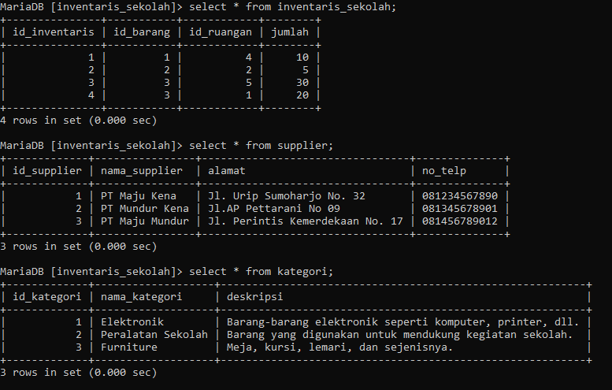
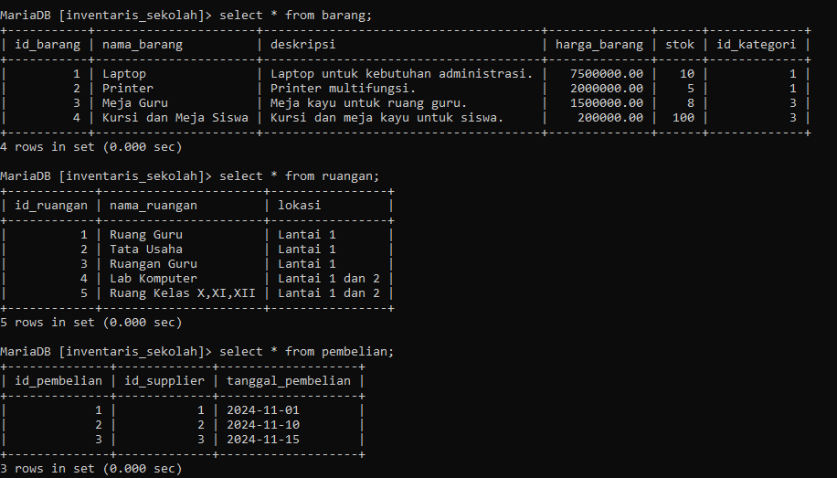
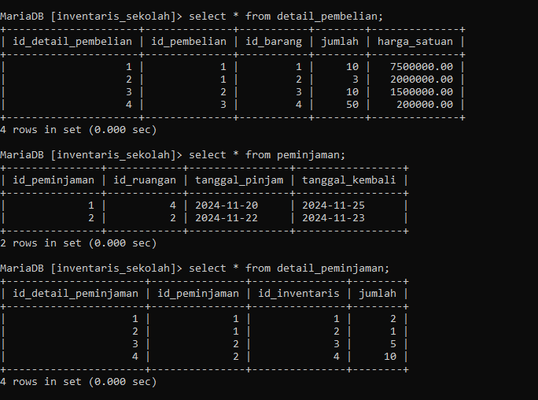
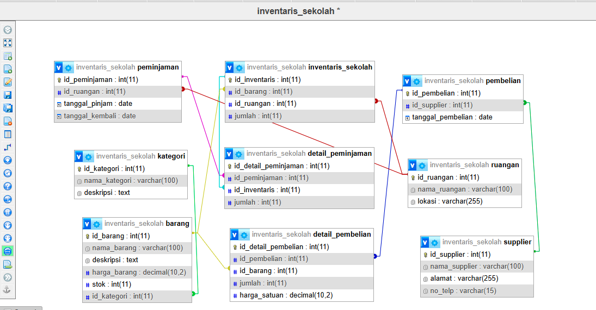
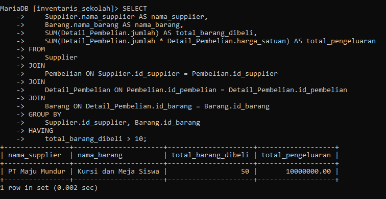
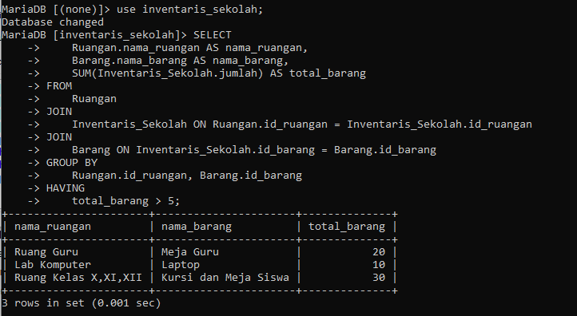

# Tabel Keaktifan
| NO  | NAMA            | KEAKTIFAN | PERAN                                  |
| :-: | :-------------- | --------- | -------------------------------------- |
|  1  | ABD RAHMAN      | 3         | membantu mencari query dan penjelasan  |
|  2  | HANSAR          | 3         | mencari penjelasan query               |
|  3  | JORDAN          | 3         | mencari analisis relasi tabel          |
|  4  | MUH.TAUFIK      | 3         | Mencari dan mengerjakan relasi tabel   |
|  5  | CHAIRIL ABIZALI | 3         | Mengerjakan dan mencari analisis query |

---
## Tabel Keseluruhan






---
## Hasil Relasi Tabel

#### Penjelasan Relasi Antar Tabel
1. **Supplier:** Data mencatat pemasok barang ke sekolah. Contohnya, "PT Maju Mundur" yang menyediakan barang seperti laptop dan printer.
2. **Kategori:** Setiap barang memiliki kategori, seperti "Elektronik" atau "Furniture".
3. **Barang:** Data barang sekolah seperti laptop, printer, dan meja, masing-masing dengan harga, stok, dan kategori.
4. **Pembelian dan Detail_Pembelian:** Setiap pembelian mencatat barang yang dibeli beserta jumlah dan harga satuan. Misalnya, pembelian pertama mencakup 5 laptop dan 3 printer.
5. **Ruangan:** Data ruangan tempat barang inventaris ditempatkan, seperti "Laboratorium Komputer".
6. **Inventaris_Sekolah:** Barang-barang yang disimpan di setiap ruangan, misalnya 10 laptop di lab komputer.
7. **Peminjaman dan Detail_Peminjaman:** Peminjaman barang dari ruangan tertentu, seperti 2 laptop dan 1 printer dipinjam dari lab komputer pada tanggal 20 November 2024.
#### Analisis Antar Tabel
Relasi antar tabel menunjukkan bagaimana data saling terhubung dan mendukung pengelolaan informasi inventaris sekolah secara menyeluruh. Berikut adalah analisis relasi berdasarkan kasus:
- **Supplier dan Barang melalui Pembelian**  
    Data ini memungkinkan kita untuk melacak supplier mana yang menyediakan barang tertentu. Relasi ini penting untuk pengelolaan pengadaan barang dan evaluasi kinerja supplier.
- **Kategori dan Barang**  
    Setiap barang dikelompokkan berdasarkan kategori tertentu, seperti "Elektronik" atau "Furniture." Ini memudahkan pengelompokan dan analisis barang untuk tujuan pengelolaan aset.
- **Barang dan Inventaris Sekolah**  
    Relasi ini menunjukkan barang apa saja yang tersedia di setiap ruangan. Hal ini berguna untuk manajemen aset fisik sekolah, seperti mengetahui di mana barang tertentu ditempatkan.
- **Inventaris Sekolah dan Peminjaman**  
    Relasi ini memungkinkan pelacakan barang yang dipinjam dari inventaris sekolah. Data ini penting untuk menghindari kehilangan barang dan memastikan barang yang dipinjam dikembalikan tepat waktu.

## 2 contoh query,yang menampilkan datanya secara kontekstual dengan menggunakan query relasi, group by, dan having secara bersamaan dalam satu query.

### Query 1
```mysql
SELECT Supplier.nama_supplier AS nama_supplier,Barang.nama_barang AS nama_barang,SUM(Detail_Pembelian.jumlah) AS total_barang_dibeli,SUM(Detail_Pembelian.jumlah * Detail_Pembelian.harga_satuan) AS total_pengeluaran
FROM Supplier
JOIN Pembelian ON Supplier.id_supplier = Pembelian.id_supplier
JOIN Detail_Pembelian ON Pembelian.id_pembelian = Detail_Pembelian.id_pembelian
JOIN Barang ON Detail_Pembelian.id_barang = Barang.id_barang
GROUP BY Supplier.id_supplier, Barang.id_barang
HAVING total_barang_dibeli > 10;
```

### Hasil

### Penjelasan Dan Analisis Query 1
	**Contoh 1: Menampilkan Total Barang yang Dibeli per Supplier**
**Query ini bertujuan untuk menganalisis data pembelian dari supplier dengan fokus pada:**
- Barang apa saja yang disediakan oleh setiap supplier.
- Berapa total barang yang dibeli dari masing-masing supplier.
- Berapa besar total pengeluaran untuk barang-barang tersebut.

**Detail Penjelasan:**
- **JOIN:**
    - _Supplier_ → Mengidentifikasi supplier barang.
    - _Pembelian_ → Menentukan pembelian barang berdasarkan supplier.
    - _Detail_Pembelian_ → Menyediakan informasi detail jumlah barang dan harga satuan dari setiap pembelian.
    - _Barang_ → Menyediakan nama barang untuk hasil yang lebih deskriptif.
- **GROUP BY:**  
    Data dikelompokkan berdasarkan kombinasi supplier dan barang agar setiap baris hasil query menunjukkan kontribusi tiap supplier untuk barang tertentu.
- **HAVING:**  
    Memfilter hasil dengan hanya menampilkan barang yang total jumlah pembeliannya lebih dari 10. Ini untuk memfokuskan analisis pada supplier yang memberikan kontribusi signifikan.

**Analisis**
- Supplier yang paling sering menyuplai barang dalam jumlah besar, seperti _PT Maju Mundur (misalnya, kursi dan meja sebanyak 50 unit), adalah kandidat supplier utama yang bisa dinegosiasikan lebih lanjut untuk pembelian berikutnya.
- Dengan menghitung total pengeluaran, sekolah bisa mengetahui berapa besar kontribusi supplier terhadap biaya pengadaan.
- Query ini membantu manajemen untuk mengoptimalkan hubungan dengan supplier yang memberikan barang dalam jumlah besar sekaligus mencari peluang untuk mendapatkan harga yang lebih kompetitif.
---
### Query 2
```mysql
SELECT Ruangan.nama_ruangan AS nama_ruangan,Barang.nama_barang AS nama_barang,SUM(Inventaris_Sekolah.jumlah) AS total_barang
FROM Ruangan
JOIN Inventaris_Sekolah ON Ruangan.id_ruangan = Inventaris_Sekolah.id_ruangan
JOIN Barang ON Inventaris_Sekolah.id_barang = Barang.id_barang
GROUP BY Ruangan.id_ruangan, Barang.id_barang
HAVING total_barang > 5;
```
### Hasil

### Penjelasan Dan Analisis Query 2
	**Contoh 2: Menampilkan Total Barang dalam Inventaris per Ruangan**

**Query ini bertujuan untuk mengetahui alokasi barang di setiap ruangan dengan fokus pada ruangan yang memiliki barang lebih dari 5 unit.**

**Detail Penjelasan:**
- **JOIN:**
    - _Ruangan_ → Mengidentifikasi lokasi barang dalam inventaris.
    - _Inventaris_Sekolah_ → Menyediakan data barang yang tersedia di setiap ruangan.
    - _Barang_ → Menyediakan nama barang untuk membuat hasil lebih informatif.
- **GROUP BY:**  
    Data dikelompokkan berdasarkan kombinasi ruangan dan barang sehingga setiap baris menunjukkan jumlah barang tertentu di satu ruangan.
- **HAVING:**  
    Memfilter hasil hanya untuk barang yang jumlahnya lebih dari 5 unit di suatu ruangan. Hal ini membantu fokus pada barang-barang yang memiliki jumlah signifikan.

**Analisis:**
- Lab komputer memiliki barang elektronik seperti laptop dalam jumlah besar (10). Hal ini sesuai dengan fungsinya sebagai tempat aktivitas teknologi.
- Kelas X,XI,dan XII memiliki kursi (30 unit) dan meja (8 unit) yang cukup memadai untuk mendukung kegiatan belajar-mengajar.
- dan Ruang Guru Yang memiliki meja guru sebesar (20 unit).
- Informasi ini membantu pihak sekolah untuk:
    - Memastikan alokasi barang yang memadai di setiap ruangan.
    - Mengetahui ruangan yang memiliki kelebihan atau kekurangan barang, sehingga memungkinkan rotasi atau redistribusi barang.
---